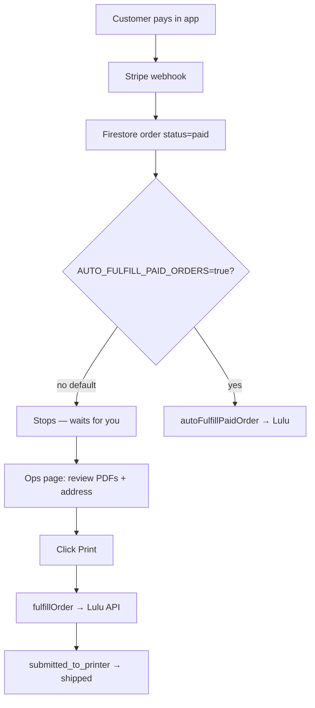

# Print ops queue (manual approval → one Print button)

Paid print orders **no longer auto-submit to Lulu by default**. You review each order in a small web dashboard, then click **Print** to send cover PDF, interior PDF, shipping, and product SKU to Lulu in one step.

## How it works



| Step | What happens |
|------|----------------|
| Payment | Stripe charges customer; `users/{uid}/orders/{orderId}` created with `status: paid`, PDF paths/URLs, shipping, SKU. |
| Queue | Order appears on **Print Ops** until it has a `luluPrintJobId`. |
| Your review | Open cover/interior PDF links, Stripe payment, shipping — all on one card. |
| **Print** | `fulfillOrder` uploads signed URLs to Lulu, creates print job, updates Firestore. |
| Tracking | Lulu webhooks update status (`printing`, `shipped`, tracking URL). |

**You do not** manually upload files on lulu.com. PDFs stay in Firebase Storage; Lulu downloads them via temporary signed URLs when you click Print.

## One-time setup

### 1. Admin email allow-list

Cloud Functions must know your ops login email.

Create or edit `functions/.env` (not committed):

```bash
ADMIN_EMAILS=you@yourdomain.com,other@yourdomain.com
AUTO_FULFILL_PAID_ORDERS=false
```

Redeploy functions so env vars load:

```bash
firebase deploy --only functions --project memoirai-7db06
```

Alternatively set `admin: true` custom claim on your Firebase Auth user.

Sign in on the ops page with the **same email/password** as the MemoirAI app (Firebase Auth).

### 2. Deploy hosting (ops UI)

```bash
firebase deploy --only hosting --project memoirai-7db06
```

Open the **admin portal**:

- **https://memoirai-7db06.web.app/ops**
- or **https://memoirai-7db06.firebaseapp.com/ops**

Sign in with **Continue with Google** (same account as the MemoirAI app — most users are `google.com` only). Email/password is also enabled if you created a password on that Firebase user. Your email must be in `ADMIN_EMAILS`.

### 3. (If sign-in fails) Register a Web app

Firebase Console → Project settings → Your apps → Add **Web** app → copy `appId` into `public/ops/index.html` (`firebaseConfig.appId`).

Email/password sign-in must be enabled in Authentication → Sign-in method.

## Daily workflow

1. Open **Print Ops** URL and sign in.
2. **Needs your Print** — orders with `paid` or `lulu_failed` and no Lulu job yet.
3. Check cover preview, PDF links, address, Stripe link.
4. Click **Print — send to Lulu** → confirm → wait for success alert (`luluJobId`).
5. Optional: enable **Show recent** to see jobs already submitted.
6. Track in [Lulu developer portal](https://developers.lulu.com) and Firestore.

### Retry a failed order (e.g. signed-URL bug)

Orders in `lulu_failed` stay in the queue. Fix backend if needed, redeploy, then **Print** again on the same card.

## Cloud Functions reference

| Callable | Purpose |
|----------|---------|
| `adminListPrintOrders` | Lists pending + optional recent orders (admin only). |
| `fulfillOrder` | Submits one order to Lulu (`orderId`, `userId`). |

| Env var | Default | Meaning |
|---------|---------|---------|
| `ADMIN_EMAILS` | (empty) | Comma-separated emails allowed to use admin callables + ops UI. |
| `AUTO_FULFILL_PAID_ORDERS` | `false` | If `true`, restores immediate `autoFulfillPaidOrder` on new `paid` orders. |

## Terminal fallback (no browser)

```bash
cd functions
GCLOUD_PROJECT=memoirai-7db06 node scripts/admin-orders.js list
node scripts/admin-orders.js show <orderId>
```

Print still requires calling `fulfillOrder` with an admin ID token (use the ops web UI).

## Links

- Firestore: https://console.firebase.google.com/project/memoirai-7db06/firestore
- Stripe Live: https://dashboard.stripe.com/payments
- Lulu: https://developers.lulu.com
- Runbook: `functions/scripts/PRINT_ORDER_FLOW_RUNBOOK.md`
